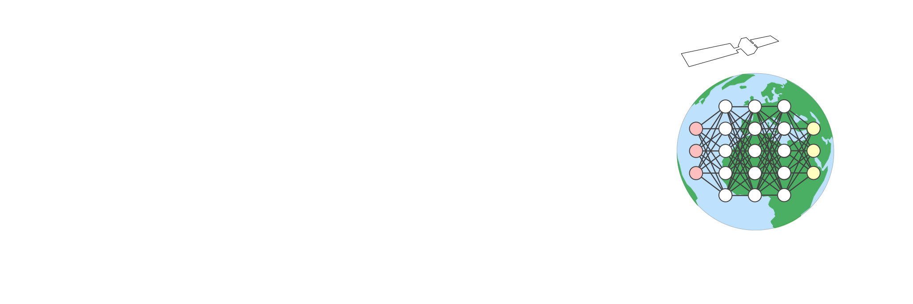
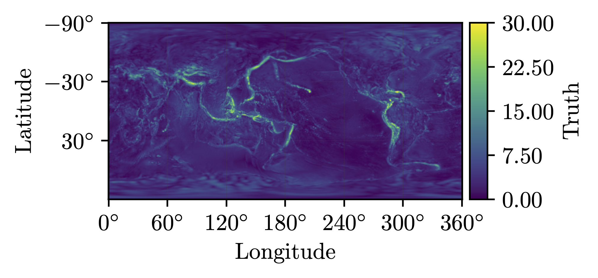

<div align="center">
  
</div>

# Welcome to the GravNN repo!

This repository contains the `GravNN` python package whose purpose is to train Physics-Informed Neural Networks Gravity Models (PINN-GMs). The package itself contains the tensorflow models, physics constraints, hyperparameter configurations, data generators, and visualization tools used in training such models. 

The `Examples` directory provides a set of minimal example scripts that leverage the core components of `GravNN` package to train a PINN and visualize some basic performance metrics. 

> :earth_americas: **If you are only interested in running a PINN gravity model (not training)**: the [GravityModel](https://www.github.com/joma5012/GravityModels) repository will have a collection of pre-trained PINN-GMs available on June of 2023 with the official release of PINN-GM-III. In the meantime the spherical harmonic, polyhedral, and point mass models are currently available. 

The `Scripts` directory provides a collection of python scripts and notebooks which make use of the components in `GravNN` for various research tasks. Given that, please note that this directory is under development and is currently used for exclusively for research -- not production. As such, not all scripts will work out of the box. Future releases will address these issues. If you do want to explore around in spite of this, I recommend starting from `Scripts/Networks/train_tensorflow_2.py` and traversing the GravNN package from there. 

Enjoy!

# Install

```
git clone https://github.com/joma5012/GravNN.git
cd GravNN/
pip install -e .
```

# Read the papers!
[PINN Gravity Model Revisited (Generation III)](https://hanspeterschaub.info/Papers/Martin2023.pdf)

[PINN Gravity Models for Small Bodies (Generation II)](https://link.springer.com/article/10.1007/s10569-022-10101-8)

[PINN Gravity Models for the Earth and Moon (Generation I)](https://link.springer.com/article/10.1007/s10569-022-10069-5)

# Motivation

The Physics-Informed Neural Network Gravity Model (PINN-GM) aims to solve many of the limitations of past gravity representations including the ubiquitous spherical harmonic and polyhedral gravity models (used for planetary and small-body exploration respectively). 

## Inconveniences of the Spherical Harmonic Gravity Model

The spherical harmonic gravity model has garnered widespread adoption for Earth orbiting satellites and mission settings due to its efficient capture of planetary oblateness. Requiring only a low-degree expansions, dynamicists can capture one of the largest global-scale perturbations to high accuracy. The problem, however, is that once planetary oblateness is accounted for, other major dynamical perturbations exist:

<div align="center">
  
</div>
In particular, features like prominent mountain ranges (Himalayas, Andes, etc), boundaries between tectonic plates, and regional hotspots each generate considerable gravitational perturbations. These features are unique in that they are predominately discontinuous, geographically localized features. 

## Discontinuity + Periodic Basis = Bad Idea
Spherical harmonics (the 3D analog to a Fourier series) are particularly ill-suited to represent such features. Take for example the famous [Gibbs phenomenon](https://en.wikipedia.org/wiki/Gibbs_phenomenon) -- an attempt to represent a discontinuous square-wave or heaviside function using an infinite number of periodic bases. 

An infinite number of sine and cosine harmonics must be superimposed together before these discontinuous features are represented accurately. The same problem exists for the Earth (or other planetary) gravity modelling problems. Despite this, considerable effort has been put forth to generate high-fidelity spherical harmonic models --- some which contain more than 4-million parameters. Rather than continuing to fund efforts and mission to further refine these high-fidelity spherical harmonic model, perhaps a more interesting question to ask is if a better basis function could be used --- one that accommodates the most significant perturbations first without prescribing unnatural geometries onto the problem. 

## Periodic Bases are Prone to Aliasing

Not only are spherical harmonics not naturally suited to capture the important planetary gravitational features beyond oblateness, they are also difficult to regress. When attempting to resolve high-degree coefficients in the gravity model, $n(n+1)$ samples must be collected in an evenly distributed manner in both latitude and longitude to ensure the harmonic is adequately sampled and not aliasing a different harmonic signal. 

## Operational Limitations

Spherical harmonics also begin to numerically diverge within the bounding sphere thanks to the $\left(\frac{R}{r}\right)^l$ term in the harmonic expansion where $R$ is the reference radius of the body and $r$ is the distance to the field point in question. This poses problems particularly in small body settings for which the asteroid or comet may have a geometry that exists primarily within the bounding, Brillouin sphere. 

## Polyhedral Model

As a result of this numerical divergence, many dynamicists turn to an alternative gravity model: the polyhedral gravity model. The polyhedral gravity model derives the potential of an arbitrary constant density shape model (.obj, .stl, etc) comprised of facets and vertices. This choice allows for the analytical, non-divergent representation of gravitational bodies with arbitrary geometries. The difficulty with this representation is that high-fidelity shape models can be comprised of hundreds-of-thousands of vertices and facets which must be looped over each time step during dynamics propagation. This process is extremely expensive both within simulation and on-board spacecraft. Moreover, it makes assumptions about the density of the body in question which can lead to erroneous dynamics.

# The Physics-Informed Neural Network Gravity Model (PINN-GM)

The Physics-Informed Neural Network Gravity Model attempts to bypass each of these challenges. By learning, rather than prescribing, basis functions, the PINN-GM is able to learn the most efficient and compact set of basis functions to represent the problem at hand. This leads to order-of-magnitude faster run-times without making any assumptions about the underlying density distribution of the body. Moreover, the representation remains numerically convergent regardless of operation domain (near or far from the surface). Best of all, the representation is rooted in analytics, using physics-informed constraints to ensure that the learned model is consistent with the governing gravitational differential equations (Laplace's equation, conservative vector field properties, gradient relationships between accelerations and underlying potential, etc.)

<div align="center">
  
</div>

Documentation is coming soon! 